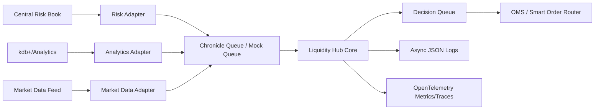

# Rust Liquidity Hub Playground

[](https://github.com/vtsyryuk/rust-playground/actions/workflows/ci.yml)
[](https://github.com/vtsyryuk/rust-playground/actions/workflows/coverage.yml)
[](https://github.com/vtsyryuk/rust-playground/actions/workflows/codeql.yml)
[](https://github.com/vtsyryuk/rust-playground/actions/workflows/sonarcloud.yml)
[](https://github.com/vtsyryuk/rust-playground/actions/workflows/security.yml)
[](https://github.com/vtsyryuk/rust-playground/actions/workflows/dependency-review.yml)
[](https://github.com/vtsyryuk/rust-playground/actions/workflows/dependency-submission.yml)
[](https://github.com/vtsyryuk/rust-playground/actions/workflows/cd.yml)
[](https://github.com/vtsyryuk/rust-playground/actions/workflows/publish.yml)
[](https://github.com/vtsyryuk/rust-playground/actions/workflows/cloud-e2e.yml)

This repository is a learning project for building a low-latency Rust microservice for an equities cash trading platform.

The service acts as a liquidity hub:

- receives risk appetite from a central risk book
- consumes market data ticks
- consumes analytics/fair-value signals from kdb or a mocked analytics feed
- makes quote/hold decisions
- publishes decisions through a Chronicle-style low-latency transport
- exposes an operational path for build, test, deploy, logging, and OpenTelemetry

The current code is intentionally small. The hot path is in `liquidity-hub-core`, with no async runtime, no network code, and no logging.

## Architecture



## Design Principles

For a target of a few microseconds per decision, the architecture should separate the hot path from the operational shell.

The hot path should:

- use fixed-size integer prices and quantities, not floating point
- avoid allocation while processing each tick
- avoid logging per tick unless sampled or written to an async queue
- avoid `.await` inside the decision function
- keep state local to the thread where possible
- use structs and enums for explicit domain modeling
- use Chronicle Queue, shared memory, Aeron, or kernel-bypass networking for real low-latency boundaries

The operational shell can use:

- Tokio for lifecycle, admin tasks, signal handling, and slower IO
- OpenTelemetry for metrics and traces
- structured JSON logs with non-blocking writers
- Kubernetes for normal cloud deployment
- dedicated bare-metal or tuned compute for true microsecond production latency

Cloud Kubernetes is useful for development, integration, replay, and control-plane services. For the actual few-microsecond trading path, expect CPU pinning, tuned Linux, careful NIC/interrupt placement, and usually colocated bare metal.

## Workspace

- `crates/liquidity-hub-core`: pure decision engine and Rust basics playground
- `crates/chronicle-transport`: mock Chronicle-style queue traits and future Chronicle Enterprise adapter boundary
- `crates/liquidity-hub-app`: runnable mock service
- `docs/architecture.md`: deeper design notes
- `docs/rust-learning-path.md`: Rust concepts taught through this project
- `docs/observability.md`: logging and OpenTelemetry guidance
- `docs/cicd.md`: CI/CD publishing and deployment notes
- `deploy/k8s`: Kubernetes deployment skeleton
- `render.yaml`: Render Blueprint for a simple cloud health-check deployment
- `.github/workflows/ci.yml`: build and test pipeline

## Commands

Install Rust from [rustup.rs](https://rustup.rs), then run:

```bash
cargo fmt
cargo test
cargo run -p liquidity-hub-app -- --ticks 100
```

Useful release checks:

```bash
cargo clippy --workspace --all-targets -- -D warnings
cargo test --workspace
cargo build --release --workspace
```

Run the cloud-style health endpoint locally:

```bash
LH_SERVE_ADMIN=true RUST_LOG=info cargo run -p liquidity-hub-app -- --ticks 100
curl http://localhost:8080/health
curl http://localhost:8080/ready
```

## CI/CD

GitHub Actions are configured with:

- `.github/workflows/ci.yml`: format, clippy, tests, release build, and Docker build check
- `.github/workflows/actions.yml`: actionlint validation for workflow files
- `.github/workflows/coverage.yml`: LCOV coverage with `cargo-llvm-cov`
- `.github/workflows/codeql.yml`: Rust CodeQL analysis
- `.github/workflows/sonarcloud.yml`: SonarCloud analysis when `SONAR_TOKEN`, `SONAR_ORGANIZATION`, and `SONAR_PROJECT_KEY` are configured
- `.github/workflows/security.yml`: RustSec audit and cargo-deny policy checks
- `.github/workflows/dependency-review.yml`: dependency review for pull requests
- `.github/workflows/dependency-submission.yml`: Cargo dependency snapshot submission to GitHub's dependency graph
- `.github/workflows/cd.yml`: publish image to GitHub Container Registry on `main` and `v*` tags
- `.github/workflows/publish.yml`: release/manual image publishing
- `.github/workflows/cloud-e2e.yml`: cloud health checks against `CLOUD_BASE_URL`
- optional manual Kubernetes deploy using repository secret `KUBE_CONFIG`

See `docs/cicd.md` for operating notes.

Published images use:

```text
ghcr.io/<owner>/<repo>/liquidity-hub:<git-sha>
```

### Build Artifacts

- Release binary: `target/release/liquidity-hub-app`
- Docker image: `ghcr.io/vtsyryuk/rust-playground/liquidity-hub:<git-sha>`
- Coverage LCOV: `target/coverage/lcov.info`
- Local logs: `logs/liquidity-hub.jsonl`
- Kubernetes manifest: `deploy/k8s/liquidity-hub.yaml`
- Render Blueprint: `render.yaml`

### Quality Gates

- Formatting: `cargo fmt --all -- --check`
- Linting: `cargo clippy --workspace --all-targets -- -D warnings`
- Tests: `cargo test --workspace --locked`
- Coverage: `cargo llvm-cov --workspace --locked --lcov --output-path target/coverage/lcov.info`
- Audit: RustSec through `.github/workflows/security.yml`
- Policy: cargo-deny through `deny.toml`
- Static analysis: CodeQL and SonarCloud

## Chronicle Integration

Chronicle Queue Enterprise currently advertises native Rust support, and Chronicle publishes Rust API docs for queue builders, appenders, and tailers. This repo keeps Chronicle behind `EventSink` and `EventSource` traits so local learning and tests work without a commercial dependency.

Production integration should implement:

- `EventSink` using a Chronicle `ExcerptAppender`
- `EventSource` using a Chronicle `ExcerptTailer`
- binary serialization compatible with the rest of your platform
- one queue per traffic class: risk, analytics, market data, decisions, audit

## Latency Roadmap

1. Start with correctness: domain types, deterministic tests, replayable events.
2. Remove avoidable allocations from the tick path.
3. Add criterion benchmarks around `LiquidityEngine::on_tick`.
4. Replace JSON mock serialization with a fixed binary layout.
5. Add Chronicle Enterprise adapter.
6. Pin hub thread to a CPU and isolate it from async/admin work.
7. Add percentile latency histograms and replay tests.
8. Tune OS, CPU governor, IRQ affinity, NUMA placement, and container settings.
